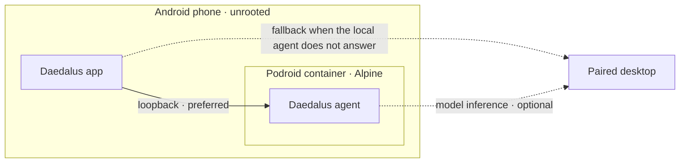
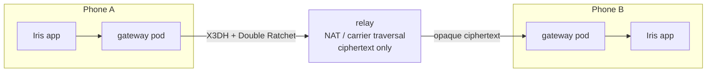
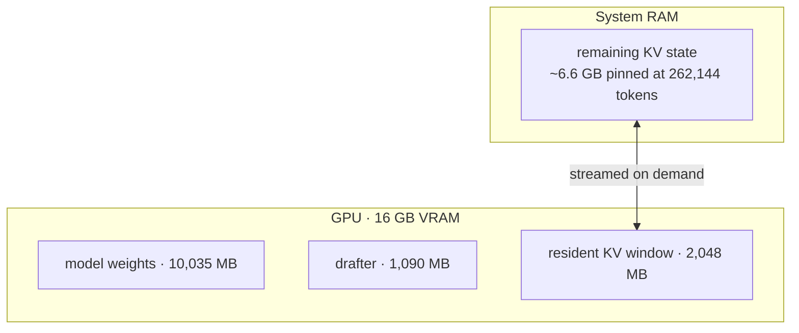
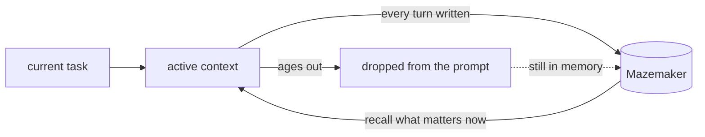
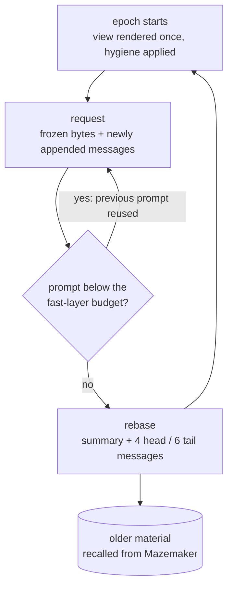
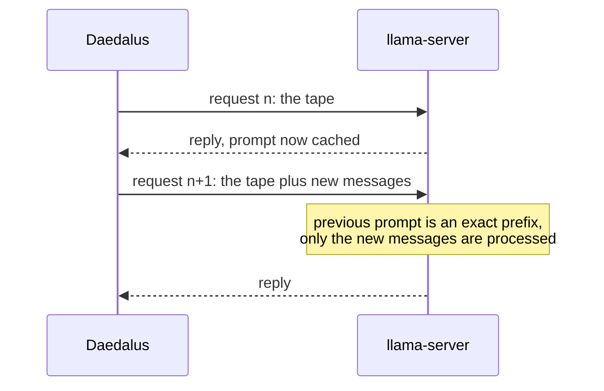
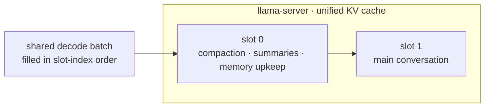
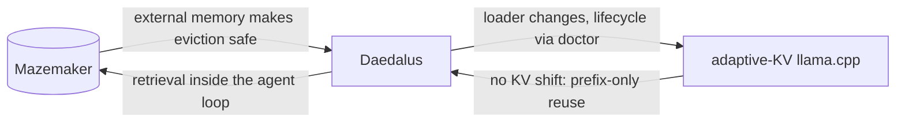
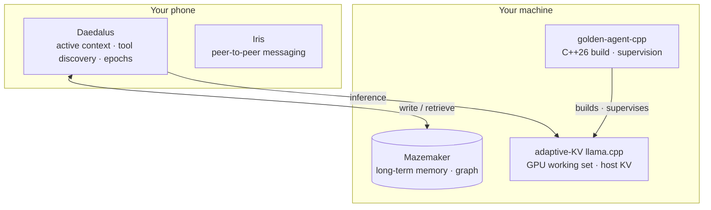

# Daedalus

Daedalus is an AI agent designed around two constraints:

- the model should not have to carry its entire history in every request;
- the system should remain usable on consumer hardware.

> **The short version**
>
> - Daedalus runs a 27B dense model with a 262,144-token context on a 16 GB consumer GPU.
> - The active KV window stays on the GPU; the rest of the KV state is streamed from system RAM.
> - The agent deliberately does not carry its complete history. [Mazemaker](https://mazemaker.online) stores it and provides retrieval.
> - The prompt is append-only between compaction points, preserving prefix reuse instead of repeatedly rebuilding the middle of the conversation.
> - Tool and skill descriptions are discovered when needed rather than inserted into every request.
> - The agent runs on the phone. There is no central Daedalus service holding its data.
> - Its driver was ported from Python to C++26 by the agent itself, mid-experiment.
>
> The rest of this document describes how those pieces work and the measurements behind them.

---

## Local first, by construction

### The agent lives on the device

Daedalus can run on Android, unrooted. Podroid provides the container runtime,
Alpine runs inside it, and the agent runs there. The phone application talks
to the local agent over loopback whenever it answers and falls back to a paired
desktop only when it does not. The model itself may still run on the paired
machine.



**The agent is local to the device. The model does not have to be.**

### There is nowhere else for the data to be

There is no central Daedalus service storing the agent's data: no account, no
server-side copy to leak, sell or hand over. That is an architectural decision
rather than a promise made by a privacy policy, and it was written down before
anything was built on it: [On Local-First Data
Sovereignty](https://mazemaker.online/manifesto/), April 2026, unchanged since.

### Iris: the same position, applied to messaging

[Iris](https://iris.mazemaker.online) is encrypted peer-to-peer messaging whose
gateway runs on your phone. No account. No central server. No company reading
your messages, because there is no server for them to be read from.

Iris pairs two phones directly. Each one runs its own gateway — a small Linux
pod, on-device, via Podroid. Messages are encrypted with the protocol family
Signal uses (X3DH + Double Ratchet) before they leave the phone. A relay exists
only to get through NAT and carrier firewalls; it forwards opaque ciphertext
and cannot read a word of it.



Iris ships in **The Box**. It was never on the plan: it came to light as a
bypass product and grew up beside Daedalus rather than after it.

Daedalus and Iris share one rule: **put state as close to the endpoint as
practical, and let the infrastructure between endpoints know as little as
possible.**

---

## Hardware and inference

The reference configuration is a single RTX 4060 Ti with 16 GB of VRAM:

```text
NVIDIA RTX 4060 Ti · 16 GB

main model        10,035 MB   Qwen3.8-27B dense
draft model        1,090 MB   DFlash2 Q4_K_M
resident KV pool   2,048 MB
memory engine        300 MB   222,409 memories / 1,500,622 connections

remaining          ~2.9 GB    CUDA context, compute buffers, display
```

The measured generation rate is approximately 27 tokens/s on average, with
runs reaching roughly 40 tokens/s.

The important constraint is not the model weights alone. It is the KV cache.
For this model an unquantised KV representation costs approximately 73 KB per
token, so a 262,144-token context needs roughly 19 GB for KV state alone:

```text
model weights       ~10 GB
262k-token KV       ~19 GB
                    ------
                    ~29 GB     on a 16 GB card
```

Daedalus therefore keeps only the currently active KV window on the GPU. The
remainder stays in host memory and is streamed as required, by the
[adaptive-KV fork of llama.cpp](https://github.com/RaymondHuang210129/llama.cpp-adaptive-kv-streaming).



The context is still full attention. Older conversation is not replaced by a
summary merely because the complete context does not fit in VRAM.

---

## Context is a resource

A large context window does not automatically make an agent effective. An
agent can have hundreds of tools, skills and thousands of messages available
while only a small fraction is relevant to the current operation. Putting all
of that into every request consumes context without adding information.

Daedalus treats prompt contents as a resource to be selected. A measured
session:

| Material                |        Before |        After |
| ----------------------- | ------------: | -----------: |
| Skill catalogue         | 24,470 tokens |   329 tokens |
| Working-session context | 70,397 tokens | 8,967 tokens |

The skill catalogue accounted for most of the original context, although none
of its entries were needed for the operation.

- **Tools are discovered.** 18 tools sit in the active window; 91 exist. The
  rest are found when required.
- **Catalogues are searched.** The complete skill set stays available without
  serialising every description into every prompt.
- **Old state leaves the active context.** The agent's reasoning is written to
  Mazemaker the first time it is sent. When it ages out it is dropped from the
  prompt — no scratch file, no path — and recalled if it becomes relevant.
  Only when the memory engine is unreachable does it fall back to disk.
- **Old tool output becomes a reference.** A finished tool exchange leaves as
  one line naming the call; the agent runs it again if it needs the output.
- **The conversation is externalised.** Every turn is written to Mazemaker as
  it happens.

Daedalus does not solve long-term memory by continually enlarging the prompt.
**Without a memory backend, this is deliberate forgetting without retrieval.**
Mazemaker is not an optional optimisation for this architecture; it is the
storage layer that makes context eviction usable. If you are not going to run
it, run a different agent.

---

## Mazemaker

The reference memory instance holds **222,409 memories and 1,500,622
connections**. Benchmarked in public, negative controls included:

| Measurement                                   |      Result |
| --------------------------------------------- | ----------: |
| LongMemEval R@5 · 500 questions, 25k haystack |      0.8426 |
| LongMemEval R@10                              |      0.9000 |
| Two-hop reasoning R@10                        | 0.00 → 1.00 |
| `gemma3:270m` on a Raspberry Pi               |       18/20 |

The two-hop result matters most for this architecture: it measures retrieval
of connected information, which a flat nearest-neighbour index cannot do.
Full notes: [Inception Benchmarking](https://mazemaker.online/blog/inception-benchmarking/).



The objective is not to keep everything in the prompt. It is to keep what is
currently useful and make the rest recoverable.

---

## Model utilisation

The reference agent uses `Qwen3.8-27B`, a dense 27-billion-parameter model: all
27B parameters participate in every token. It is quantised to roughly three
bits per weight with
[ISTA-DASLab's GSQ-RCO](https://huggingface.co/ISTA-DASLab/Qwen3.8-27B-GSQ-RCO-GGUF),
which is what lets a dense model of that size coexist with the large context on
the reference GPU.

A separate experiment used `Qwen3.6-35B-A3B`, a mixture-of-experts model with
about 3B active parameters per token, at `IQ3_XXS`. It produced a 682-line
animated WebGL page from scratch in approximately 40,000 tokens —
[mazemaker.online/wall-of-shame](https://mazemaker.online/wall-of-shame).

The point is not that quantisation is free or that small models equal large
ones. It is narrower: **prompt overhead can become a substantial part of an
agent's workload, and removing it changes what a given model can do without
changing the model.**

---

## A controlled comparison

Same model, same task, same machine. `Qwen3.6-35B-A3B` was asked for a browser
Snake game in two different harnesses. Both produced a working game.

|              | Conventional harness |     Daedalus |
| ------------ | -------------------: | -----------: |
| Context used |         25.7K / 256K |  9.4K / 262K |
| Result       |         Working game | Working game |

Daedalus finished in two calls with about 63% less context. The number matters
operationally: on long-running work, carrying historical material makes the
amount of useful work that fits into the context depend more and more on prompt
management. Daedalus treats the active context as a working set instead.

---

## Long-running work

A transcript-based agent eventually has to decide what to do with its oldest
material: keep growing the context, summarise, truncate, or rebuild a shorter
history on every request. Each has its own cost.

Daedalus uses a different boundary:

1. render the conversation once;
2. keep the resulting bytes as an append-only sequence;
3. reuse that prefix on every subsequent request;
4. rebase the active window when it reaches its budget;
5. drop what no longer belongs in the window;
6. retrieve it from Mazemaker if it becomes relevant again.



This matters because the reference inference server cannot shift the model's
live KV cache. The model's rotary position encoding cannot be shifted and its
recurrent portion only truncates at the tail, so the cache is reused only when
the previous prompt is an exact prefix of the next one — not when a section in
the middle has been edited.

---

## The tape

An earlier implementation kept editing the middle of the conversation to
expire reasoning, collapse tool calls and prune stale results. Every edit cost
the prefix.

What that looked like, measured:

```text
reused per call      12,363 tokens     system prompt and tool schemas only
since server start  395,333 prompt tokens processed
                    161,744 tokens reused
time                    801 s prompt processing
                        587 s generation
```

The agent spent more time re-reading its own prompt than writing answers.

The replacement treats the request as a tape. A message is rendered once;
every later request reuses those exact bytes. Context hygiene happens at the
rebase boundary, not on every call.

The budget is set by the fast layer, not by the context window. KV streaming
keeps a fixed number of 256-token pages per layer on the GPU — 157 at a
1,024 MiB stage, about 40,200 tokens — and under a unified KV cache both slots
share them. Past that the server starts demoting pages to system RAM and decode
slows (measured: 30–35 t/s up to ~33k tokens, 16–22 t/s at 45–48k). So the
rebase lands at 32,000 tokens and its summary starts at 60%, while the summary
job and the conversation still fit side by side. A larger stage raises all of
it proportionally.



Across twenty synthetic test calls:

```text
previous approach    17 prefix breaks
tape approach         0 prefix breaks
```

`context.payload_tape: false` restores the old per-call rendering.

The server constraint became part of the agent's architecture instead of
something the harness kept working around.

---

## Context management

Every tuned number is a reference-machine measurement, not a universal default.
Move to another GPU, CPU or memory configuration and the trade-offs change.

| Setting                |    Reference value | Reason                                                                             |
| ---------------------- | -----------------: | ---------------------------------------------------------------------------------- |
| KV pool                |            2048 MB | what fits beside the weights on a 16 GB card                                       |
| Context                |            262,144 | ~6.6 GB of pinned host RAM, a standing reservation for the process lifetime        |
| Rebase                 |      32,000 tokens | what the resident KV window holds: 256-token pages, 157 per layer at a 1,024 MiB stage ≈ 40,200 tokens, shared by both slots; prep starts at 60% |
| Rebase keeps           |    4 head · 6 tail | small enough that the next epoch has room; older material is recalled, not carried |
| Thinking budget        |             12,000 | measured answers land between 150 and 2,400 tokens                                 |
| KV cache               | K=`q8_0`, V=`q4_0` | K is more sensitive to attention accuracy than V; ~25 KB/token at this setting     |
| Draft                  |             Q4_K_M | default speculative decoder                                                        |
| Draft under heavy load |                 Q2 | lower draft cost when CPU and system contention dominate                           |

## Speculative decoding

The default drafter is `DFlash2 Q4_K_M`. Under heavy system load — past 100% —
a Q2 drafter gives better wall-clock throughput despite lower acceptance (≈0.45
measured). The drafter competes for the same machine as everything else, so the
right choice depends on load, not on draft quality or file size alone.

## A unified inference server

The reference setup runs two server slots over a unified KV cache. The main
conversation is pinned to slot 1; compaction, summarisation and memory
maintenance run on slot 0.



The order is intentional. llama-server fills its shared decode batch by walking
slots in index order and stops at the first one that would overflow it. With the
main request on slot 0, its large prefills starved the background work; swapping
them let background operations progress beside the foreground request.

Two slots and block KV streaming only go together under a unified KV cache:
streaming needs a single KV stream, and `--kv-unified` collapses any slot count
into one. Launch `-np 2` without it and the server refuses to start with
`block KV streaming requires exactly one sequence (-np 1)`. `daedalus doctor
start` adds `-kvu` whenever a KV pool and more than one slot are configured; a
hand-written launch has to add it itself.

Background work does not fight over slot 0. Compaction summaries, memory
flushes and the skill/memory review go through one queue, one request at a
time, and hygiene always goes first: a waiting compaction overtakes a queued
review, and nothing that is already running gets interrupted.

One flag is part of the performance model rather than a preference.
`--cache-idle-slots` is **on by default**, and under a unified KV cache it clears
idle slots on every task launch — so each slot wipes the other's cached prefix
and both re-prefill the same history. **`--no-cache-idle-slots` is required.**

---

## What was fixed along the way

Ordinary engineering defects, found by using the system continuously. Recorded
because they affected this lineage, not as claims about other implementations.

- **Search could report false negatives.** File search ran through a shell
  pipeline, so an invalid pattern came back as *no matches*. A search for
  `legacy_connect(` returned zero hits where five existed.
- **Context size was stale.** The harness trusted a cached 131,072-token
  context from an older launch while the running server reported 262,144. It
  now asks the server first.
- **Plugins disappeared on install.** Package metadata was missing, so an
  installed copy carried no plugin manifests although the source checkout
  worked.
- **Two functions could never have run.** One imported a helper that existed
  nowhere; the other used a name it never imported.
- **One configuration error dominated failures.** A single misconfigured field
  caused about 73% of logged errors, each retry burning 13–16K tokens. Nothing
  crashed; it just cost inference time and made the model look slow.
- **Memory recovery made outages worse.** On a failed memory call the plugin
  restarted the memory pod's front process, dropping every other client's
  session while the real fault sat elsewhere. It now reports which unit is down
  and restarts nothing.

---

## Getting it

`./install.sh` installs the `daedalus` command and creates `~/.daedalus/`.
`daedalus setup` walks the first run.

The inference side belongs to `daedalus doctor`:

| Command                                    | What it does                                                      |
| ------------------------------------------ | ----------------------------------------------------------------- |
| `daedalus doctor`                          | inspect toolchain, sources, models, memory backend and servers    |
| `daedalus doctor setup`                    | build adaptive-KV llama.cpp and pull the models                   |
| `daedalus doctor start`                    | start the inference server, and the memory backend if it is down  |
| `daedalus doctor start a3b`                | the same with Qwen3.6-35B-A3B on the same port, slots and context |
| `daedalus doctor watch`                    | restart the server if generation throughput collapses             |
| `daedalus doctor pause` / `resume`         | freeze the servers with the weights still loaded                  |
| `daedalus doctor stop` · `status` · `logs` | the rest of the lifecycle                                         |

Configuration is written to `$DAEDALUS_HOME/stack.conf` on first use —
repository, model identifiers, ports, context size, KV pool, thinking budget —
and read from there afterwards. Machine-specific values are configuration, not
hard-coded assumptions. `scripts/stack.sh` remains as a compatibility entry
point. The memory backend is independent and runs as its own pod.

Daedalus also runs against anything OpenAI-shaped (llama.cpp, Ollama, vLLM,
OpenRouter, Anthropic, your own endpoint), writes its own skills, delegates to
subagents, keeps working through a gateway and scheduled jobs, and talks over
Discord, ACP and MCP.

### The C++26 driver

[golden-agent-cpp](https://github.com/itsXactlY/golden-agent-cpp) is the
one-command entry point: a single C++26 executable that builds the adaptive-KV
server, fetches the configured model, supervises the process and falls back
from GPU to CPU by itself. No Python, no virtual environment.

It is a port of the Python driver, and Daedalus wrote it. The port was not a
planned rewrite: it happened while KV-cache changes were being tested under
real agentic work, as proof-of-concept research, because it could. More than
ten hours, with no token creep.

---

## How the pieces formed each other

The current architecture was not designed as one finished system and then
implemented. Its most important constraints emerged from running the
components together — and this is not the first time that has happened here.
The [Inception Bench and Mazemaker formed each other](https://mazemaker.online/blog/inception-benchmarking/)
the same way.



- **Mazemaker changed Daedalus**: externalised memory made deliberate context
  eviction practical.
- **Daedalus changed Mazemaker**: retrieval became part of the active agent
  loop rather than a separate storage feature, and Mazemaker's formation pass
  now runs on the server `daedalus doctor` manages.
- **The harness changed its driver**: Daedalus works on the llama.cpp fork from
  the inside — the 27B model, on this harness, editing the engine it runs on.
  On 16 September it pushed a parallel-FFN change into the model loader that
  made its own 27B fail to load; the fix landed 51 minutes later, and that fix
  is the build behind the numbers on this page.
- **The driver changed the harness**: on 11 September an endpoint for editing a
  slot's live KV cache was investigated, and the server reported `can_shift = 0`.
  Not a missing flag — the model's positional encoding and recurrent component
  forbid it. Expiring reasoning, collapsing tool calls, pruning results and
  sliding the window could therefore not rewrite the middle of the live cache.
  The harness stopped rewriting it. The request became a tape, hygiene became
  an epoch-level operation, and what ages out became retrieval state — which
  closes the loop back to Mazemaker.

The storage model is a response to the properties of the inference engine. We
did not plan it. We noticed it at two in the morning on 17 September, watching
a prefill counter, and named it.

---

## The larger project



Daedalus is one component of a set of systems built around local execution,
retrieval and endpoint ownership. It began with **remainder.online**, followed
by **mazemaker.online** and **mazemaker.dev**. The systems accumulated through
repeated testing rather than one top-down design — north of a trillion tokens
spent finding out what breaks — and some of the architecture exists
specifically because an earlier assumption failed under real workloads. That is
why this repository documents the failures. The useful output of an iteration
is not that the original design was right; it is the constraint that was
discovered and the mechanism that replaced it.

The result is not a claim that a 16 GB GPU has become a datacenter. It is a
different allocation of resources: **weights stay resident, the active KV window
stays resident, the rest of the context lives in host memory, and what no longer
belongs in the working set becomes retrievable state.**

The central optimisation is not *more context*. It is **less context carried
unnecessarily.**

---

## Provenance

Daedalus is forked from Hermes Agent **0.8.0**, the high-water mark. The fork
intentionally begins from a single commit: it diverged far enough that upstream
ancestry was misleading rather than useful. Upstream remains
[NousResearch/hermes](https://github.com/NousResearch/hermes), MIT, and the
licence travels with the code.

It does not share a home directory or namespace with Hermes and never reads
`HERMES_HOME`. Credentials are runtime state and never committed; `.example`
templates are in the tree.

## Licence

MIT, upstream Nous Research. See [LICENSE](LICENSE).
