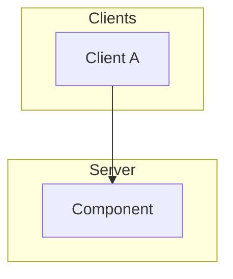
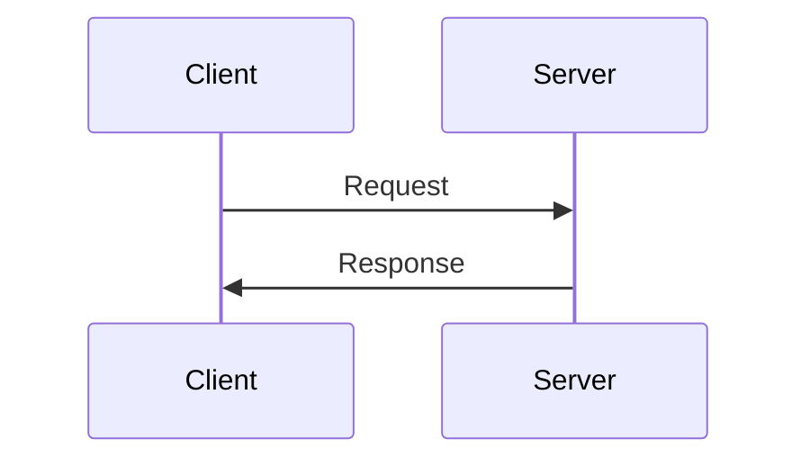
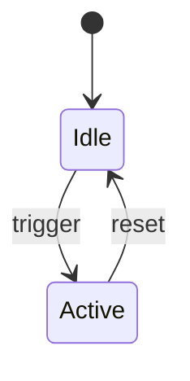
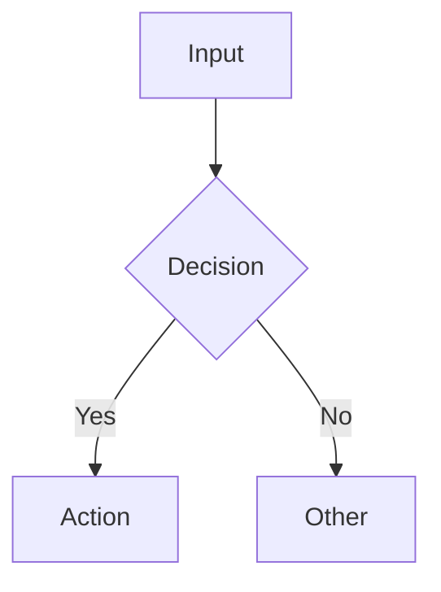
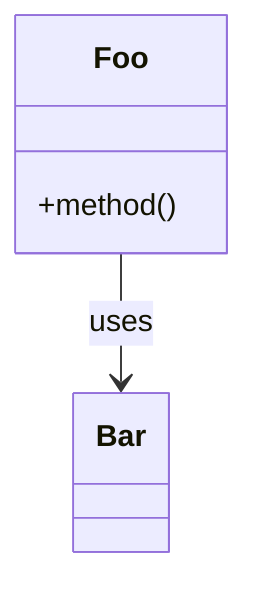

# Repo Restructure & Document

Reorganize a flat/legacy repository into a proper Python package structure with comprehensive documentation including Mermaid diagrams and ASCII art.

## When to Use

- Cloning an existing repo and reorganizing it for a new home
- Creating documentation for code you didn't write
- Adding architecture diagrams to a project

## Step 1: Analyze the Source

Read EVERY source file. Don't skim. Document:
- What each file does
- Dependencies between files
- Import paths that need updating
- Hardcoded paths that need configuration

```bash
# Quick overview
find . -type f -not -path './.git/*' | sort
# Read all source files completely
```

## Step 2: Design the Structure

Standard Python package layout:

```
project/
├── package_name/
│   ├── __init__.py          # Exports, version
│   ├── common/              # Shared utilities
│   ├── client/              # Client library (if applicable)
│   ├── server/              # Server code (if applicable)
│   ├── tools/               # CLI utilities
│   └── benchmarks/          # Stress tests
├── scripts/                  # Shell helpers (chmod +x)
├── config/                   # Defaults/templates
├── tests/                    # Test suite
├── docs/                     # Extended docs
├── README.md
├── requirements.txt
└── LICENSE
```

## Step 3: Generate ASCII Art

Use pyfiglet for proper ASCII banners:

```python
import pyfiglet

# Test multiple fonts - pick one that fits terminal width
for font in ['slant', 'doom', 'big', 'standard', 'varsity']:
    result = pyfiglet.figlet_format('Project Name', font=font)
    max_width = max(len(l) for l in result.split('\n') if l)
    if max_width <= 80:
        print(f"=== {font} ===")
        print(result)
```

Best fonts by style:
- `slant` - Clean, professional, works everywhere
- `doom` - Bold, impactful
- `standard` - Classic terminal look
- `big` - Large, readable

For two-line layouts (name + subtitle), generate separately:
```python
name = pyfiglet.figlet_format('ProjectName', font='slant')
sub = pyfiglet.figlet_format('SUBTITLE', font='slant')
print(name + sub)
```

## Step 4: Write Mermaid Diagrams

Include 3-5 diagrams covering different perspectives:

### Architecture (graph TB)


### Sequence/Flow (sequenceDiagram)


### State Machine (stateDiagram-v2)


### Data Flow (flowchart LR or TD)


### Class Diagram (classDiagram)


**CRITICAL: Verify Mermaid blocks are balanced.** Every opening ````mermaid` needs a closing ```` `:

```bash
# Check balance
python3 -c "
with open('README.md') as f:
    lines = f.readlines()
depth = 0
for i, line in enumerate(lines, 1):
    if line.strip().startswith('\`\`\`'):
        depth = 1 - depth
if depth != 0:
    print(f'ERROR: Unclosed block!')
"
```

## Step 5: Document ACCURATELY (Critical!)

**When documenting code you didn't write, VERIFY behavior by reading the source. Do NOT assume or summarize.**

Common mistakes (learned from real experience):
1. **Static vs Dynamic thresholds** - Read the actual comparison logic, don't just state a number. E.g., "16KB" might actually be "16KB normally, 8KB under memory pressure" — read the conditional logic.
2. **Separate entities** - If the code treats things as separate (different keys, different IDs), document them separately. E.g., Locks and DataStores may share a dictionary but have independent lifecycles — don't conflate them.
3. **Side effects** - Does operation A also trigger B? Read the code. E.g., "At 33% RAM, Lock AND Put are both disabled" — check every handler that calls the memory check.
4. **Ownership model** - Who can modify what? Read the identity checks carefully.
5. **Two FileNames for related resources** - The pattern "lock on X, data on X:state" is common but easy to miss if you only look at one operation type.

Verification approach:
- For each claim in the docs, find the exact line in the source
- If the original author is available, have them review (THEY WILL CATCH YOUR MISTAKES)
- Test the actual behavior with small examples
- When author says "that's wrong", believe them and fix it immediately

Verification approach:
- For each claim in the docs, find the exact line in the source
- If the original author is available, have them review
- Test the actual behavior with small examples

## Step 6: README Structure

```markdown
# Project Name
[ASCII Art]
> One-line description

## TL;DR
What it does, how it works, why it exists, quick start.

## Table of Contents

## Architecture
[Mermaid diagram]

## Components
Per-module description with API reference.

## Protocol/API Reference
Complete field-by-field documentation.

## Installation
Step-by-step setup.

## Usage Examples
Copy-pasteable code snippets.

## Security Model
What it protects, what it doesn't.

## Deeper Concepts
Link each concept to Wikipedia for learning.
| Concept | Implementation | Wikipedia |
|---------|---------------|-----------|
| Mutual Exclusion | Lock ownership | [Link](https://en.wikipedia.org/wiki/Lock_(computer_science)) |

## Project Structure
Tree view + class diagram.

## License
```

## Step 7: Commit Without Pushing

Let the user review first:

```bash
git add -A
git commit -m "Reorganize: package structure + comprehensive README"
# DO NOT push - user reviews first
```

## Step 8: Fork + PR to Upstream (If Requested)

When the user wants to contribute back to the original repo:

```bash
# Fork the upstream repo (creates fork under your account)
gh repo fork upstream-owner/repo --clone=false
# Note: if you already have a repo with same name, gh appends -1

# Clone the fork
git clone git@github.com:your-user/repo-1.git repo-fork
cd repo-fork

# Create feature branch
git checkout -b reorganize-project-structure

# Apply your changes (copy from your working dir)
rsync -av --exclude='.git' /path/to/your/working/repo/package_name/ ./package_name/
cp /path/to/your/working/repo/README.md ./

# Commit with detailed message
git add -A
git commit -m "Reorganize: detailed description"

# Push branch to fork
git push origin reorganize-project-structure

# Create PR to upstream
gh pr create --repo upstream-owner/repo \
  --head your-user:branch-name \
  --title "PR Title" \
  --body 'Detailed description...'
```

**IMPORTANT:** `gh repo fork` does NOT support `--remote` flag when a repo argument is provided. Use `--clone=false` and handle cloning separately.

## Step 9: Handle Author Corrections

**When the original author corrects your documentation, fix IMMEDIATELY.** Do not argue, do not delay. The author knows their code better than you do.

Common correction patterns:
- "That threshold is wrong" → Read the actual code logic, update diagram
- "Those are separate entities" → Split documentation, add separation notes
- "You missed that X also does Y" → Add the missing behavior to diagrams

After fixing:
```bash
git add -A && git commit -m "Fix: description of what was wrong" && git push
```

## Pitfalls

1. **Mermaid closing blocks** - Always verify with the balance check script
2. **Hardcoded paths** - Check for `/home/...` paths, replace with env vars or config
3. **Circular imports** - Test imports after restructuring
4. **Lost functionality** - Don't rename or move without checking all references
5. **Documentation lies** - If you didn't verify it, don't claim it
